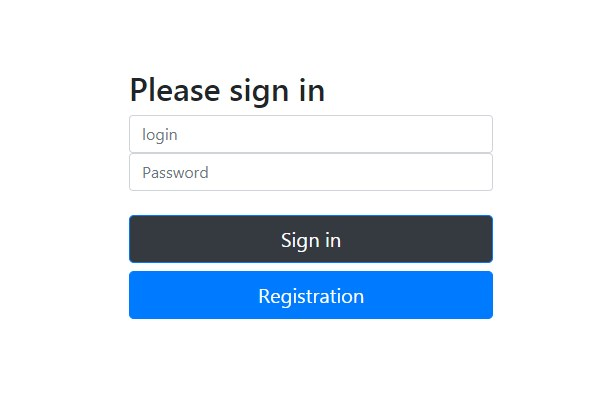
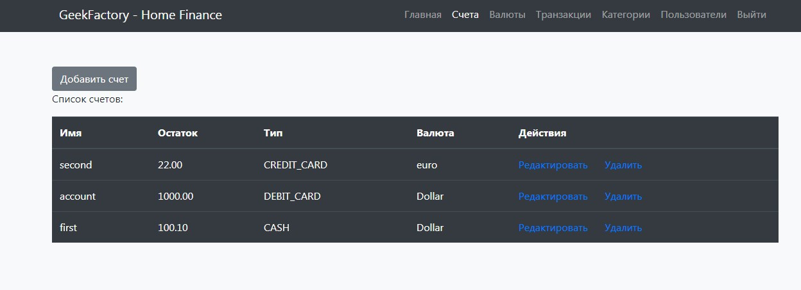
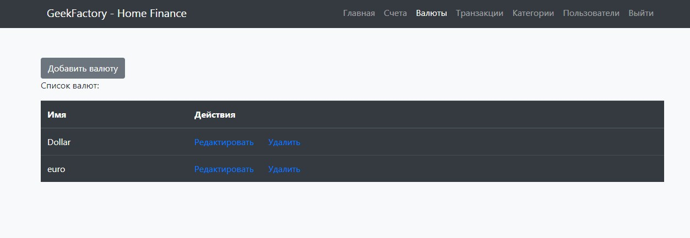
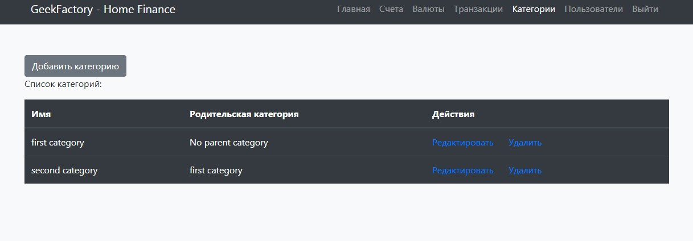
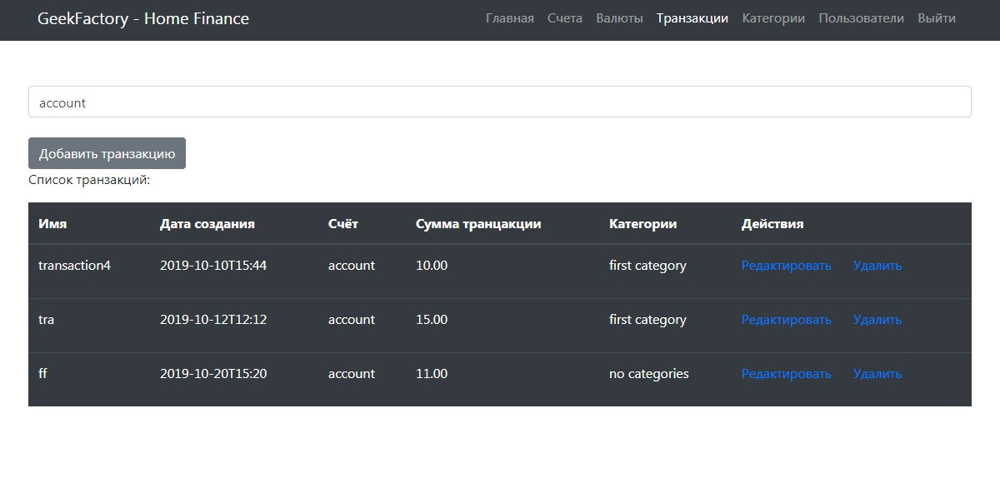
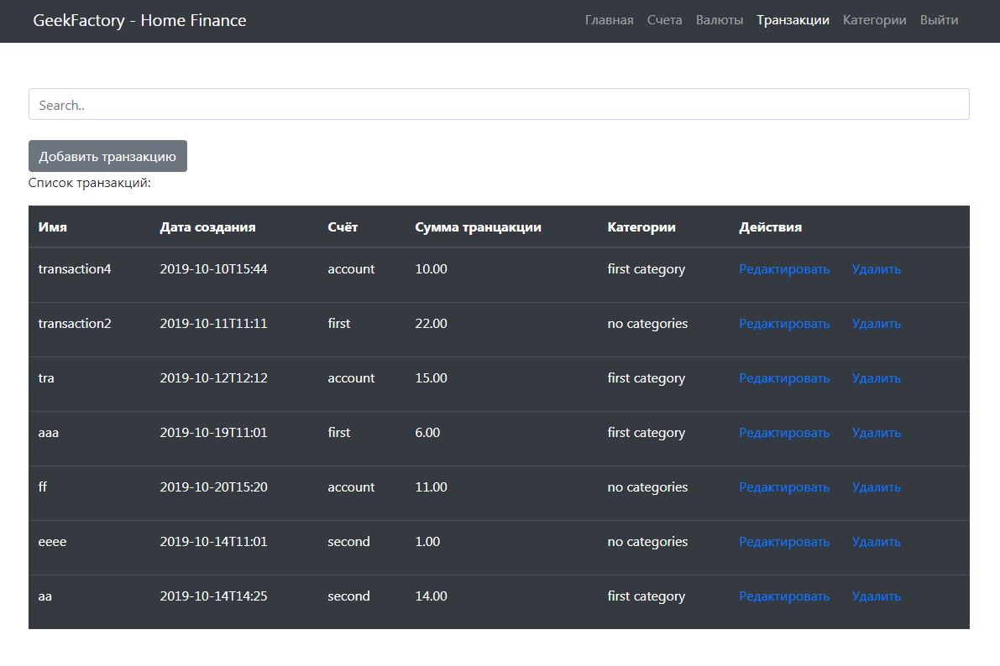
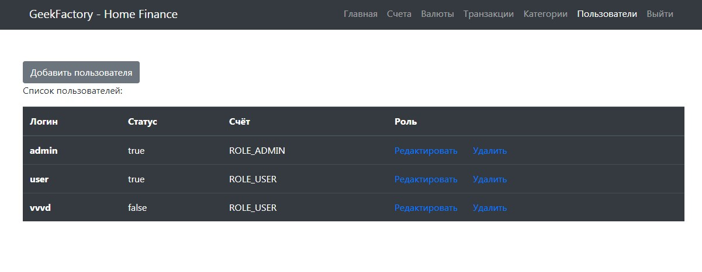
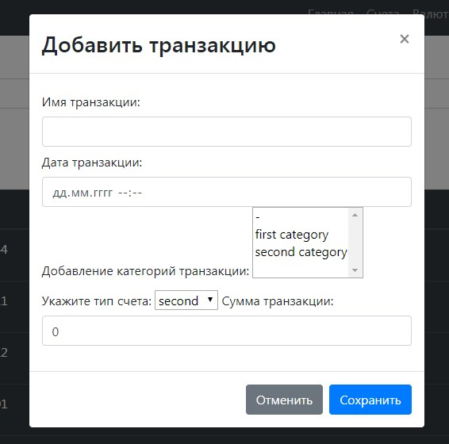

## Домашняя бухгалтерия
##### Приложение для ведения учета домашнего бюджета


##### Используемые технологии:

- Maven
- Spring Boot
- Spring Data JPA
- Spring MVC
- Spring Security Database Authentication
- Postresql
- Tomcat
- Bootstrap

#### Модули:
- dao 
- service 
- web

#### Сборка проекта:

##### Для сборки нужен *Maven 3.3.9* и выше

собирается командой: 
```yaml
mvn package
```
или если в модулях нужно удалить папку `target`:
```yaml
mvn clean package
```
Если при сборке нужно пропустить юнит тесты, то нужно добавить `-DskipTests`

#### Скриншоты приложения:

##### Страница авторизации:


##### Страница счетов:


##### Страница валют:


##### Страница категорий транзакций:


##### Страница транзакций:

Для пользователя с ролью `admin`, в шапке доступно меню `пользователи`


Для простого пользователя с ролью `user`, этого пункта меню нет


##### Страница пользователи, видно только администратору:


##### Форма создания новой транзакции: 
